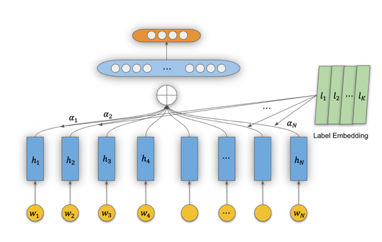
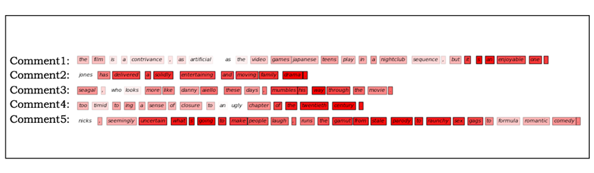
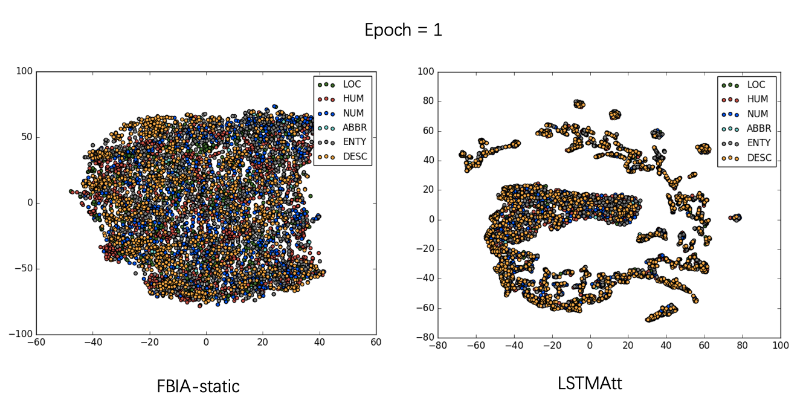
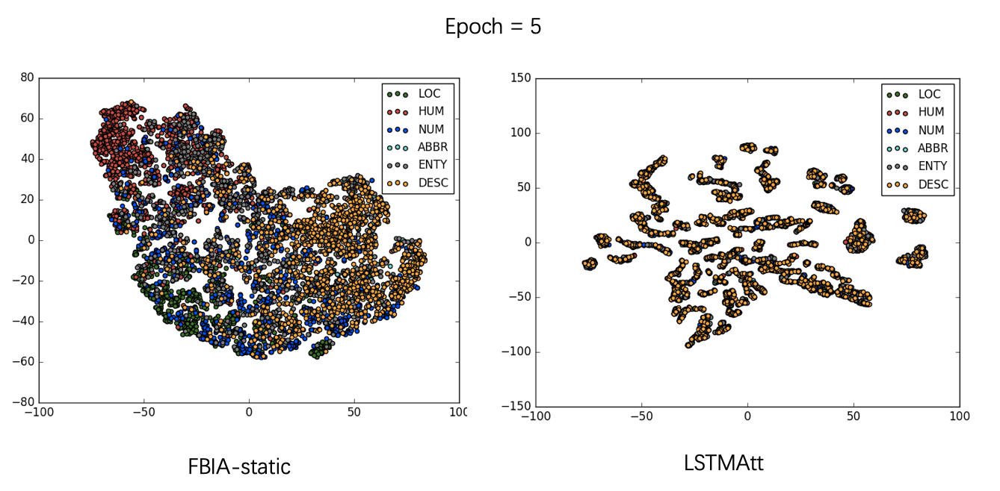
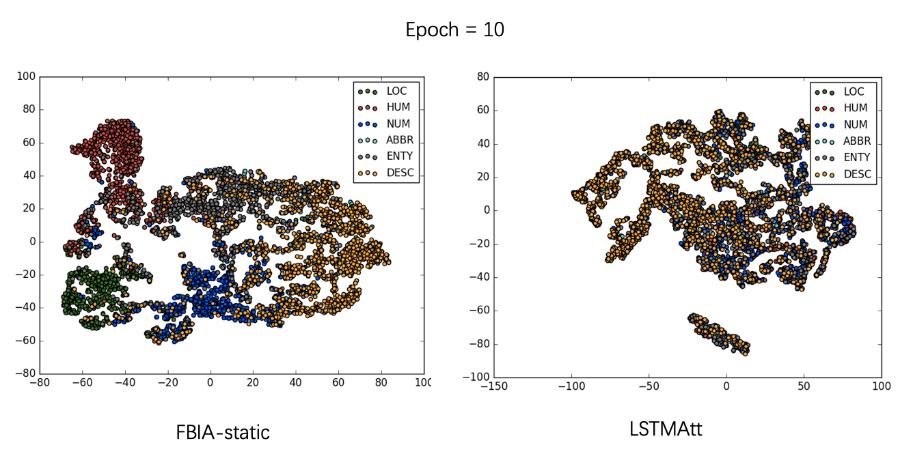
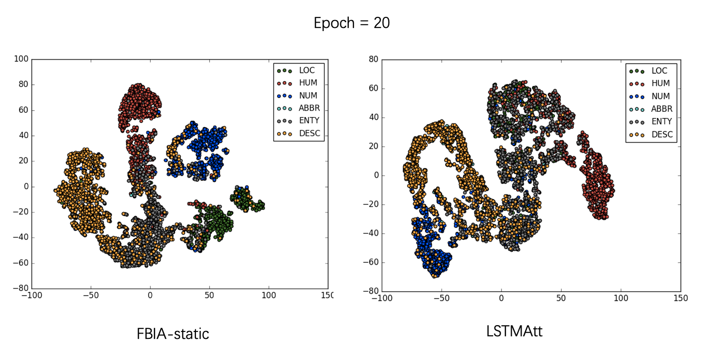
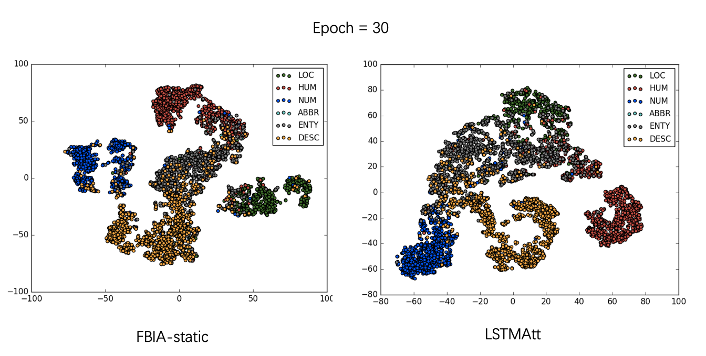
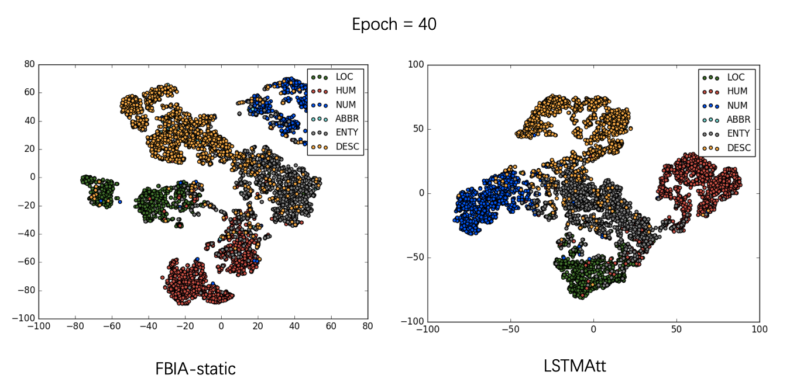
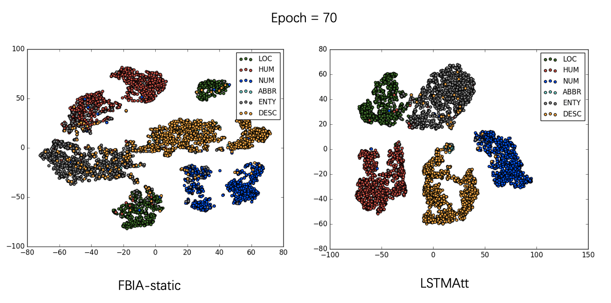
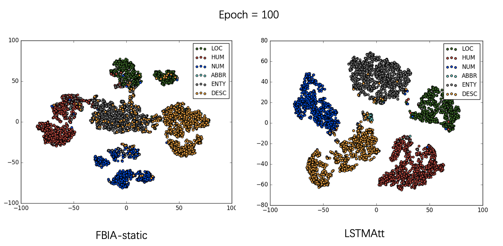

# FTIA
FTIA: Fusion of Task-specific Information based Attention Mechanism for Text Representation Learning

## 1.Environmental Requirements
- python=3.5
- pytorch=1.0
- GPU optional but recommended !

Please download GloVe word vectors in dir src/wordvectors/.static_vector_cache. More details can be found
in https://nlp.stanford.edu/projects/glove/

## 2.Datasets
Nine text classification datasets are used in our experiment.

|Dataset | Classes| Source
---------| -------------|---------
AGNews | 4|http://www.di.unipi.it/~gulli/AG_corpus_of_news_articles.html
20News|20 |http://qwone.com/~jason/20Newsgroups/
MR|2|http://www.cs.cornell.edu/people/pabo/movie-review-data/
CR|2 | https://www.cs.uic.edu/%18liub/FBS/sentiment-analysis.html
MPQA|2 |http://mpqa.cs.pitt.edu/
Subj|2|https://github.com/mhjabreel/CharCNN/tree/master/data
TREC| 6|http://cogcomp.cs.illinois.edu/Data/QA/QC/
SST-1| 5|https://nlp.stanford.edu/sentiment/
SST-2|2| https://nlp.stanford.edu/sentiment/

## 3.FTIA model
The FTIA model are constructed as follows:

## 4.Results
### 4.1 Accuracy

The experiment accuracy for each dataset and model are organized in the following table.

 |模型 | CR  | SST-1 | Subj| TREC | patent
 ------ | ------ | ------ |------ | ------ | ------ |
|TextCNN | 67.02 |31.67 |82.67|79.8|78.89
|BiGRU|72.5|36.47|87.33|83|81.33
|TLSTM|71.71|34.93|86.03|82.8|76.28
|LSTMAtt|73.83|37.51|87.47|81.6|81.41
|SelfAtt|74.71|37.01|86.53|85.8|81.15
|FTIA|77.54|43.62|92.43|86.4|82.96

### 4.2 Attention Weights

We randomly visualized the five movie reviews with corresponding learned attention weights in MR dataset, for understanding
the FTIA model. The figure is shown as follow:

### 4.3 Text Representations

For better understanding of learned text representations, we use the data reduction tool
t-SNE to transform orignal high dimensional text representations to 2-D vectors. Furthermore,
we use python scatter tool to visualize the FBIA 2-D vectors in different epochs, with the compared LSTMAtt text representations.

Please note that all experiment results are stored in all_results.csv file. And
more experiment details can be found in our original paper.